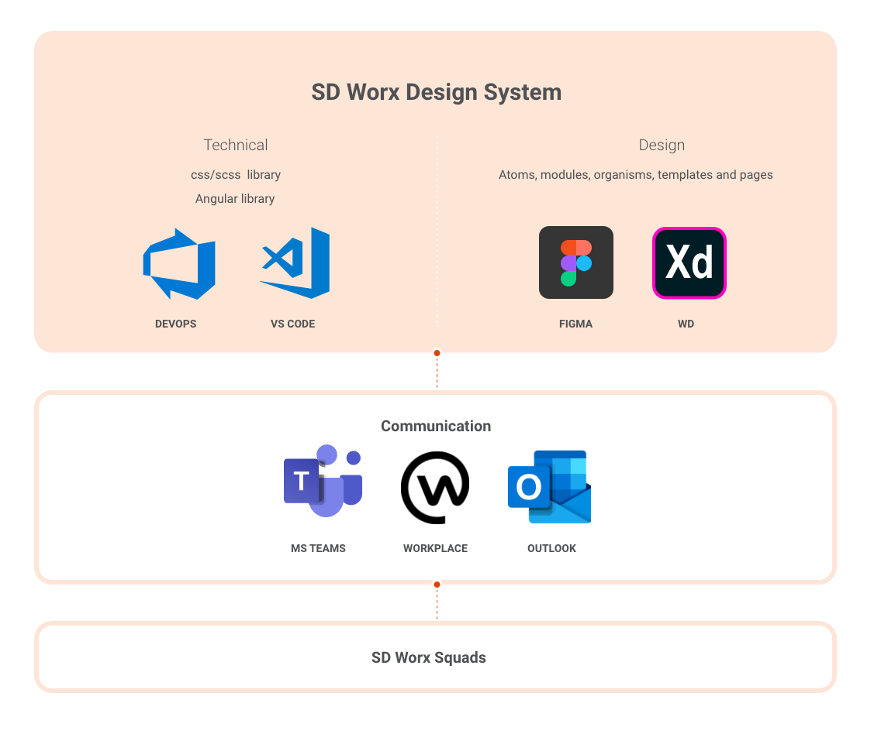

# Start your project

Whether you are a product owner, a designer or a developer, this pages is to make sure you are aware of all the tools & resources that are available to you, how to get in touch with us and how the SD Worx Design Community processes work.

Don't design and develop each component from scratch, but use what we have already created for you!

The 3 main questions you should ask yourself.

## What's your profile?

### Product owner

#### How to use this?

Consider the SDWDS as your digital handbook that will guide you through your project.  It will save you time and allocate your resource, knowing what is already available in terms of components.  Prevent common mistakes and when in doubt you will know who to contact directly.

#### The essentials

Take the time to carefully read the platform and then brief your team by showing them the specific sections that should be of interest according to their profile. Make sure they know where to download all the available assets so they don't waste time working on material that have already been released to the community.

### Designer

#### How to use this?

Add this site to your favorites as this will be a real time saviour for you.  Do not start from scratch but start based on the global library which is SD Worx Brand approved.

When there are new patterns, which are not in the global library, please let us us know so we can add them.  Everybody will be able to use your new designed patterns in a consistent matter throughout SD Worx.

#### The essentials

You'll have access to our libray wich can be downloaded at **TODO** with, access to the sdworx marketing material **TODO** , etc...

Make sure you know the foundational styles, before starting your project.  Go through the other sections when you tackle a new topic

Be sure to let us know, what we are missing so that we can help others and make sure our brand is used consistently throughout the company.

### Developer

#### How to use this?

As a developer, you work hand-in-hand with designers.  To you the most valuable assets are:

* The SDWDS is implemented for one platform, namely web based applications - **TODO**: the link to the sdworx design system implementation documentation
* Foundational Styles

#### The essentials

* Built upon the Bootstrap grids: **TODO**: link to boostrap.
* The grid structure
* **TODO**: link to the design specifications
* 

## Preparing your project

When you are on this page, this means one of two things, either you are working an a new project ore you are updating an existing project to match the SD Worx Design Language.

Well, you are on the right page.

### The basics

The SD Worx design language is based on atomic design, which allows us to be able to create beautiful and consistent web interfaces for the entire company.  It also allows a clean separation between structure and content.

#### What is atomic design?

Atom design is a helpful design and development methodology, but essentially it's merely a mental model for constructing a user interface.  

* **Atoms** are the absolute foundational building blocks that comprise all of our user interfaces.  Atoms include _color palettes, fonts, and individual basic html elements_ such as inputs, form labels, buttons,... They can't be broken down into smaller pieces.  They demonstrate all your base styles at a glance.  
* **Molecules** are relatively simle groups of UI elements \(or components\) functioning together as a unit.  For example, _a form label, search input and a button_ joined together to create a search form molecule.  Suddenly the atoms have purpose.  These can be used over and over again.
* When we put these simple, functionable and reusable components in a broader context we get **organisms**.  These are complex UI components composed of groups of molecules and/or atoms and/or other organisms.  These organisms form a distinct sections of an interface and are repeatable, pieces of our product.  For example: _a search form molecule found in the header_.  So we have a header organism, with some atoms and search molecule.  This header forms a standalone section of the interface.  \(Another example could be a product grid, category listings,...\).  Often also referred to as **modules**.
* When we place these simple and complex components into a layout and articulate the design underlying content structure we get **templates**.  Often referred to as page's skeleton. eg. a _homepage_, wich provides the context for the abstract molecules and organisms.  It shows how components look and function together in the context of a layout.  For this you can only create a good experience if you know the content.  Sometimes referred to as "low fidelity" wireframes/prototypes.
* The final level, when we use real representative content in place we get **pages**.  This is what your stakeholders will sign off and this is where you see all your components coming together to form a beautiful and functional user interface.  In this stage you're able to how all thos patterns hold up when real content is applied to the design system.  Sometimes referred to as "high fidelity" wireframes/prototypes.

#### Iterative Design

This means that the designs are not fixed and will continue evolve with the feedback of our users, these can be anybody \(product owners, designers, developers, marketeers,... and our end-users\)

Follow the what's new **TODO**: link to what's new page, to keep up to date an our latest releases.

## Supporting your Project

### Project Workflow

When to include the Center Of Excellence UX/UI and what kind of deliverables are possible.  Is a lot of assistance needed, do we have all the necessary assets.  We have our own designers, how can they deliver consistent, sdworx branded digital assets?

### Collaborative tools

Some more information about the all tools we use to help you throughout the project

## During your project

Keep in mind to regularly check the **TODO:** link to what's new page...

#### Designing a pattern/organism

What to do before you start creating new patterns

## Tools

## Share with community

#### Approve your digital asset's compliancy & share it with the community!

Once you have finished working on your digital assets, here are the steps to be followed:  
**1 -** **Share them** with us through **TODO**. We will review your design and provide **feedback**. Please make sure to drop the CoE UX/UI team a line ↗ to submit your request.  
**2 -** Once your submission is reviewed and its compliancy approved, please send us your **source file** so we can extract any new modules/features and deploy them to the SD Worx Design System community.  
**3 -** If you have metrics, share your **metrics** with us by collecting **before/after KPIs** for your website, page or element for us to have quantitative data. This is very valuable and necessary to ensure we keep delivering state-of-the-art templates, tools and ressources.  
**4 -** Other squads can now download your new digital asset's.  Keep up the good work

