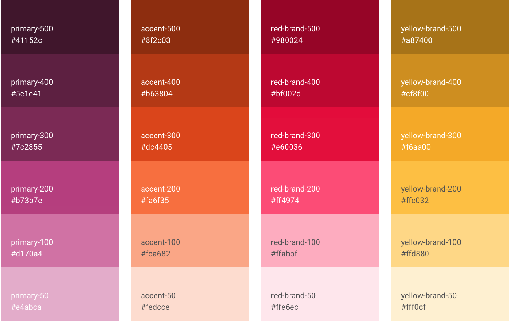

# Summary

## Use headings to create page groups like this one

> my god this is amazing

* [First page's title](https://github.com/sdworxux/design-system/tree/623a926680383ef918285d30c8ae841dbb5c093c/page1/README.md)
  * [Some child page](https://github.com/sdworxux/design-system/tree/623a926680383ef918285d30c8ae841dbb5c093c/page1/page1-1.md)
  * [Some other child page](https://github.com/sdworxux/design-system/tree/623a926680383ef918285d30c8ae841dbb5c093c/part1/page1-2.md)
* [Second page's title](https://github.com/sdworxux/design-system/tree/623a926680383ef918285d30c8ae841dbb5c093c/page2/README.md)
  * [Some child page](https://github.com/sdworxux/design-system/tree/623a926680383ef918285d30c8ae841dbb5c093c/page2/page2-1.md)
  * [Some other child page](https://github.com/sdworxux/design-system/tree/623a926680383ef918285d30c8ae841dbb5c093c/part2/page2-2.md)

## A second page group

* [Yet another page](https://github.com/sdworxux/design-system/tree/623a926680383ef918285d30c8ae841dbb5c093c/another-page.md)

